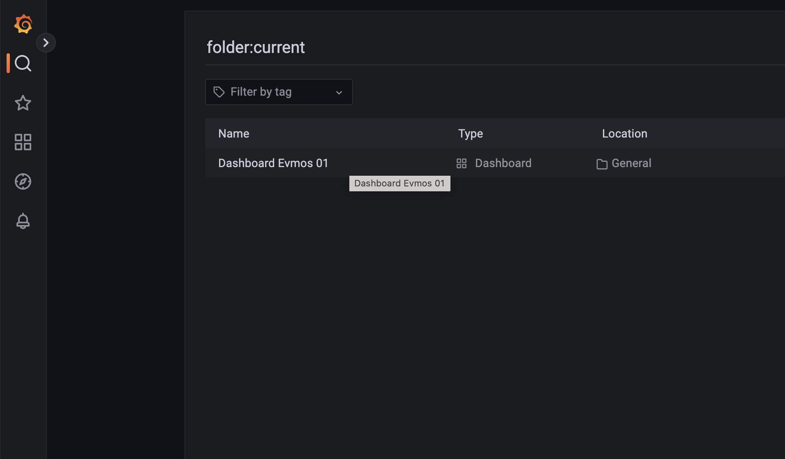

# EVMOS LAB
### Running using docker compose

Follow the steps:

```bash
git clone https://github.com/anfergainst/devops-evmos.git
docker-compose up --build -d
```

### Accessing Grafana EVMOS Blockchain Dashboard

1. After starting the docker compose environment, go to http://localhost:3000/

2. Enter `admin` for the username and password:


3. Insert a new password or skip:


4. Go to `Dashboards`:


5. Click on `Dashboard EVMOS 01`:


5. Wait for a few minutes until you get the graph populated:


6. That's it ;)

## Kubernetes

To deploy on Kubernetes, implement using the k8s yaml's and the CICD tool of your choice _(Jenkins, Bamboo, GitHub Actions, ArgoCD, etc...)_ or using the `k8s-apply` script:
```
Usage: ./k8s-apply.sh <option>
ex: ./k8s-apply.sh apply|delete|recreate|delete_full|check
```

## Extras
To check docker container logs:

```bash
docker-compose logs -f evmos-devnet1
docker-compose logs -f evmos-devnet1
docker-compose logs -f grafana
docker-compose logs -f prometheus
```
To stop the execution:

```bash
docker-compose down --volumes
```

### Using evmosd query

You can call it thru direct call:
```
# docker exec evmos-devnet1 evmosd query feemarket base-fee
base_fee: "7"
```

Or interative using the container bash:
```
# docker exec -it evmos-devnet1 /bin/bash
# evmosd query feemarket base-fee
base_fee: "7"
# evmosd query feemarket block-gas
gas: "0"
# evmosd query feemarket params
params:
  base_fee: "7"
  base_fee_change_denominator: 8
  elasticity_multiplier: 2
  enable_height: "0"
  min_gas_multiplier: "0.500000000000000000"
  min_gas_price: "0.000000000000000000"
  no_base_fee: false
```

### Some Metrics Example
> Freddy, notice that it does not contain the feemarket_base_fee natively. I could export, but had no time =(

http://localhost:26660/metrics
```
# HELP go_gc_duration_seconds A summary of the pause duration of garbage collection cycles.
# TYPE go_gc_duration_seconds summary
go_gc_duration_seconds{quantile="0"} 1.281e-05
go_gc_duration_seconds{quantile="0.25"} 5.9593e-05
go_gc_duration_seconds{quantile="0.5"} 0.000117222
go_gc_duration_seconds{quantile="0.75"} 0.000175443
go_gc_duration_seconds{quantile="1"} 0.001170485
go_gc_duration_seconds_sum 0.007993694
go_gc_duration_seconds_count 50
# HELP go_goroutines Number of goroutines that currently exist.
# TYPE go_goroutines gauge
go_goroutines 87
# HELP go_info Information about the Go environment.
# TYPE go_info gauge
go_info{version="go1.19.3"} 1
# HELP go_memstats_alloc_bytes Number of bytes allocated and still in use.
# TYPE go_memstats_alloc_bytes gauge
go_memstats_alloc_bytes 8.3548624e+07
# HELP go_memstats_alloc_bytes_total Total number of bytes allocated, even if freed.
# TYPE go_memstats_alloc_bytes_total counter
go_memstats_alloc_bytes_total 2.127911216e+09
# HELP go_memstats_buck_hash_sys_bytes Number of bytes used by the profiling bucket hash table.
# TYPE go_memstats_buck_hash_sys_bytes gauge
go_memstats_buck_hash_sys_bytes 1.932006e+06
# HELP go_memstats_frees_total Total number of frees.
# TYPE go_memstats_frees_total counter
go_memstats_frees_total 2.2743178e+07
# HELP go_memstats_gc_sys_bytes Number of bytes used for garbage collection system metadata.
# TYPE go_memstats_gc_sys_bytes gauge
go_memstats_gc_sys_bytes 1.5285104e+07
# HELP go_memstats_heap_alloc_bytes Number of heap bytes allocated and still in use.
# TYPE go_memstats_heap_alloc_bytes gauge
go_memstats_heap_alloc_bytes 8.3548624e+07
# HELP go_memstats_heap_idle_bytes Number of heap bytes waiting to be used.
# TYPE go_memstats_heap_idle_bytes gauge
go_memstats_heap_idle_bytes 6.7928064e+07
# HELP go_memstats_heap_inuse_bytes Number of heap bytes that are in use.
# TYPE go_memstats_heap_inuse_bytes gauge
go_memstats_heap_inuse_bytes 9.8238464e+07
# HELP go_memstats_heap_objects Number of allocated objects.
# TYPE go_memstats_heap_objects gauge
go_memstats_heap_objects 382145
# HELP go_memstats_heap_released_bytes Number of heap bytes released to OS.
# TYPE go_memstats_heap_released_bytes gauge
go_memstats_heap_released_bytes 2.8540928e+07
# HELP go_memstats_heap_sys_bytes Number of heap bytes obtained from system.
# TYPE go_memstats_heap_sys_bytes gauge
go_memstats_heap_sys_bytes 1.66166528e+08
# HELP go_memstats_last_gc_time_seconds Number of seconds since 1970 of last garbage collection.
# TYPE go_memstats_last_gc_time_seconds gauge
go_memstats_last_gc_time_seconds 1.6753856497981033e+09
# HELP go_memstats_lookups_total Total number of pointer lookups.
# TYPE go_memstats_lookups_total counter
go_memstats_lookups_total 0
# HELP go_memstats_mallocs_total Total number of mallocs.
# TYPE go_memstats_mallocs_total counter
go_memstats_mallocs_total 2.3125323e+07
# HELP go_memstats_mcache_inuse_bytes Number of bytes in use by mcache structures.
# TYPE go_memstats_mcache_inuse_bytes gauge
go_memstats_mcache_inuse_bytes 4800
# HELP go_memstats_mcache_sys_bytes Number of bytes used for mcache structures obtained from system.
# TYPE go_memstats_mcache_sys_bytes gauge
go_memstats_mcache_sys_bytes 15600
# HELP go_memstats_mspan_inuse_bytes Number of bytes in use by mspan structures.
# TYPE go_memstats_mspan_inuse_bytes gauge
go_memstats_mspan_inuse_bytes 789208
# HELP go_memstats_mspan_sys_bytes Number of bytes used for mspan structures obtained from system.
# TYPE go_memstats_mspan_sys_bytes gauge
go_memstats_mspan_sys_bytes 1.41984e+06
# HELP go_memstats_next_gc_bytes Number of heap bytes when next garbage collection will take place.
# TYPE go_memstats_next_gc_bytes gauge
go_memstats_next_gc_bytes 1.40593816e+08
# HELP go_memstats_other_sys_bytes Number of bytes used for other system allocations.
# TYPE go_memstats_other_sys_bytes gauge
go_memstats_other_sys_bytes 831394
# HELP go_memstats_stack_inuse_bytes Number of bytes in use by the stack allocator.
# TYPE go_memstats_stack_inuse_bytes gauge
go_memstats_stack_inuse_bytes 1.605632e+06
# HELP go_memstats_stack_sys_bytes Number of bytes obtained from system for stack allocator.
# TYPE go_memstats_stack_sys_bytes gauge
go_memstats_stack_sys_bytes 1.605632e+06
# HELP go_memstats_sys_bytes Number of bytes obtained from system.
# TYPE go_memstats_sys_bytes gauge
go_memstats_sys_bytes 1.87256104e+08
# HELP go_threads Number of OS threads created.
# TYPE go_threads gauge
go_threads 11
# HELP process_cpu_seconds_total Total user and system CPU time spent in seconds.
# TYPE process_cpu_seconds_total counter
process_cpu_seconds_total 304.35
# HELP process_max_fds Maximum number of open file descriptors.
# TYPE process_max_fds gauge
process_max_fds 1.048576e+06
# HELP process_open_fds Number of open file descriptors.
# TYPE process_open_fds gauge
process_open_fds 51
# HELP process_resident_memory_bytes Resident memory size in bytes.
# TYPE process_resident_memory_bytes gauge
process_resident_memory_bytes 1.76132096e+08
# HELP process_start_time_seconds Start time of the process since unix epoch in seconds.
# TYPE process_start_time_seconds gauge
process_start_time_seconds 1.67538412014e+09
# HELP process_virtual_memory_bytes Virtual memory size in bytes.
# TYPE process_virtual_memory_bytes gauge
process_virtual_memory_bytes 1.617842176e+09
# HELP process_virtual_memory_max_bytes Maximum amount of virtual memory available in bytes.
# TYPE process_virtual_memory_max_bytes gauge
process_virtual_memory_max_bytes 1.8446744073709552e+19
# HELP promhttp_metric_handler_requests_in_flight Current number of scrapes being served.
# TYPE promhttp_metric_handler_requests_in_flight gauge
promhttp_metric_handler_requests_in_flight 1
# HELP promhttp_metric_handler_requests_total Total number of scrapes by HTTP status code.
# TYPE promhttp_metric_handler_requests_total counter
promhttp_metric_handler_requests_total{code="200"} 102
promhttp_metric_handler_requests_total{code="500"} 0
promhttp_metric_handler_requests_total{code="503"} 0
# HELP tendermint_consensus_block_interval_seconds Time between this and the last block.
# TYPE tendermint_consensus_block_interval_seconds histogram
tendermint_consensus_block_interval_seconds_bucket{chain_id="evmos_9000-1",le="0.005"} 0
tendermint_consensus_block_interval_seconds_bucket{chain_id="evmos_9000-1",le="0.01"} 0
tendermint_consensus_block_interval_seconds_bucket{chain_id="evmos_9000-1",le="0.025"} 0
tendermint_consensus_block_interval_seconds_bucket{chain_id="evmos_9000-1",le="0.05"} 0
tendermint_consensus_block_interval_seconds_bucket{chain_id="evmos_9000-1",le="0.1"} 0
tendermint_consensus_block_interval_seconds_bucket{chain_id="evmos_9000-1",le="0.25"} 0
tendermint_consensus_block_interval_seconds_bucket{chain_id="evmos_9000-1",le="0.5"} 0
tendermint_consensus_block_interval_seconds_bucket{chain_id="evmos_9000-1",le="1"} 70
tendermint_consensus_block_interval_seconds_bucket{chain_id="evmos_9000-1",le="2.5"} 1519
tendermint_consensus_block_interval_seconds_bucket{chain_id="evmos_9000-1",le="5"} 1519
tendermint_consensus_block_interval_seconds_bucket{chain_id="evmos_9000-1",le="10"} 1519
tendermint_consensus_block_interval_seconds_bucket{chain_id="evmos_9000-1",le="+Inf"} 1519
tendermint_consensus_block_interval_seconds_sum{chain_id="evmos_9000-1"} 1538.6420518010007
tendermint_consensus_block_interval_seconds_count{chain_id="evmos_9000-1"} 1519
# HELP tendermint_consensus_block_size_bytes Size of the block.
# TYPE tendermint_consensus_block_size_bytes gauge
tendermint_consensus_block_size_bytes{chain_id="evmos_9000-1"} 596
# HELP tendermint_consensus_byzantine_validators Number of validators who tried to double sign.
# TYPE tendermint_consensus_byzantine_validators gauge
tendermint_consensus_byzantine_validators{chain_id="evmos_9000-1"} 0
# HELP tendermint_consensus_byzantine_validators_power Total power of the byzantine validators.
# TYPE tendermint_consensus_byzantine_validators_power gauge
tendermint_consensus_byzantine_validators_power{chain_id="evmos_9000-1"} 0
# HELP tendermint_consensus_full_prevote_message_delay Difference in seconds between the proposal timestamp and the timestamp of the latest prevote that achieved 100% of the voting power in the prevote step.
# TYPE tendermint_consensus_full_prevote_message_delay gauge
tendermint_consensus_full_prevote_message_delay{chain_id="evmos_9000-1"} 0.004928783
# HELP tendermint_consensus_height Height of the chain.
# TYPE tendermint_consensus_height gauge
tendermint_consensus_height{chain_id="evmos_9000-1"} 1521
# HELP tendermint_consensus_latest_block_height The latest block height.
# TYPE tendermint_consensus_latest_block_height gauge
tendermint_consensus_latest_block_height{chain_id="evmos_9000-1"} 1520
# HELP tendermint_consensus_missing_validators Number of validators who did not sign.
# TYPE tendermint_consensus_missing_validators gauge
tendermint_consensus_missing_validators{chain_id="evmos_9000-1"} 0
# HELP tendermint_consensus_missing_validators_power Total power of the missing validators.
# TYPE tendermint_consensus_missing_validators_power gauge
tendermint_consensus_missing_validators_power{chain_id="evmos_9000-1"} 0
# HELP tendermint_consensus_num_txs Number of transactions.
# TYPE tendermint_consensus_num_txs gauge
tendermint_consensus_num_txs{chain_id="evmos_9000-1"} 0
# HELP tendermint_consensus_quorum_prevote_message_delay Difference in seconds between the proposal timestamp and the timestamp of the latest prevote that achieved a quorum in the prevote step.
# TYPE tendermint_consensus_quorum_prevote_message_delay gauge
tendermint_consensus_quorum_prevote_message_delay{chain_id="evmos_9000-1"} 0.004928783
# HELP tendermint_consensus_rounds Number of rounds.
# TYPE tendermint_consensus_rounds gauge
tendermint_consensus_rounds{chain_id="evmos_9000-1"} 0
# HELP tendermint_consensus_total_txs Total number of transactions.
# TYPE tendermint_consensus_total_txs gauge
tendermint_consensus_total_txs{chain_id="evmos_9000-1"} 0
# HELP tendermint_consensus_validator_last_signed_height Last signed height for a validator
# TYPE tendermint_consensus_validator_last_signed_height gauge
tendermint_consensus_validator_last_signed_height{chain_id="evmos_9000-1",validator_address="0C85BC4D7A518D35AC18F59AE93D64616F0543A2"} 1520
# HELP tendermint_consensus_validator_power Power of a validator
# TYPE tendermint_consensus_validator_power gauge
tendermint_consensus_validator_power{chain_id="evmos_9000-1",validator_address="0C85BC4D7A518D35AC18F59AE93D64616F0543A2"} 1
# HELP tendermint_consensus_validators Number of validators.
# TYPE tendermint_consensus_validators gauge
tendermint_consensus_validators{chain_id="evmos_9000-1"} 1
# HELP tendermint_consensus_validators_power Total power of all validators.
# TYPE tendermint_consensus_validators_power gauge
tendermint_consensus_validators_power{chain_id="evmos_9000-1"} 1
# HELP tendermint_mempool_size Size of the mempool (number of uncommitted transactions).
# TYPE tendermint_mempool_size gauge
tendermint_mempool_size{chain_id="evmos_9000-1"} 0
# HELP tendermint_state_block_processing_time Time between BeginBlock and EndBlock in ms.
# TYPE tendermint_state_block_processing_time histogram
tendermint_state_block_processing_time_bucket{chain_id="evmos_9000-1",le="1"} 56
tendermint_state_block_processing_time_bucket{chain_id="evmos_9000-1",le="11"} 1520
tendermint_state_block_processing_time_bucket{chain_id="evmos_9000-1",le="21"} 1520
tendermint_state_block_processing_time_bucket{chain_id="evmos_9000-1",le="31"} 1520
tendermint_state_block_processing_time_bucket{chain_id="evmos_9000-1",le="41"} 1520
tendermint_state_block_processing_time_bucket{chain_id="evmos_9000-1",le="51"} 1520
tendermint_state_block_processing_time_bucket{chain_id="evmos_9000-1",le="61"} 1520
tendermint_state_block_processing_time_bucket{chain_id="evmos_9000-1",le="71"} 1520
tendermint_state_block_processing_time_bucket{chain_id="evmos_9000-1",le="81"} 1520
tendermint_state_block_processing_time_bucket{chain_id="evmos_9000-1",le="91"} 1520
tendermint_state_block_processing_time_bucket{chain_id="evmos_9000-1",le="+Inf"} 1520
tendermint_state_block_processing_time_sum{chain_id="evmos_9000-1"} 2225.832088999999
tendermint_state_block_processing_time_count{chain_id="evmos_9000-1"} 1520
```